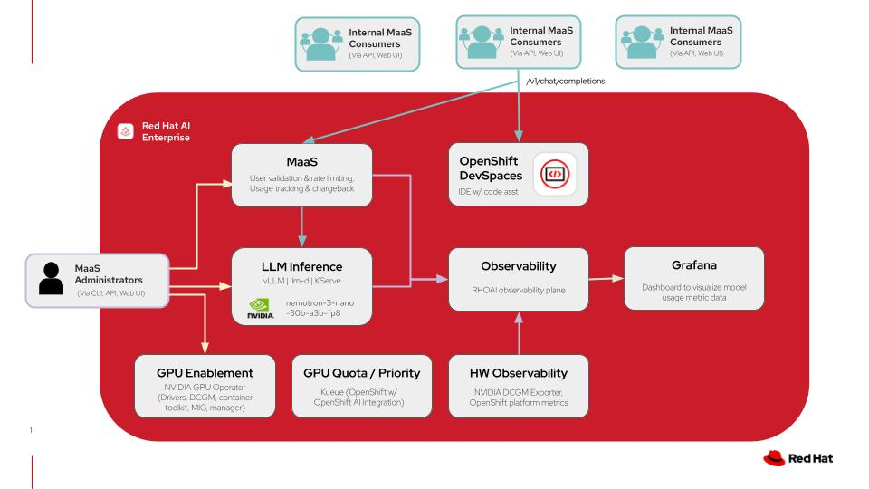

# Accelerate enterprise development with NVIDIA and MaaS

Optimize app development using the latest NVIDIA Nemotron models through Models-as-a-Service on your own private
multi-tenant infrastructure in Red Hat AI.

## Table of contents

- [Detailed description](#detailed-description)
  - [Architecture diagrams](#architecture-diagrams)
- [Requirements](#requirements)
  - [Minimum hardware requirements](#minimum-hardware-requirements)
  - [Minimum software requirements](#minimum-software-requirements)
  - [Required user permissions](#required-user-permissions)
- [Deploy](#deploy)
  - [Prerequisites](#prerequisites)
  - [Installation Steps](#installation-steps)
  - [Delete](#delete)
- [References](#references)
- [Advanced Deployment](#advanced-deployment)
  - [Prerequisites](#prerequisites-1)
  - [Installation Steps](#installation-steps-1)
- [Tags](#tags)

## Detailed description

Developing software with speed and efficiency is a competitive necessity. Developers are often overwhelmed and slowed
down by repetitive code, complicated debugging and testing, and the constant need to learn new technologies. AI-powered
coding assistance can help, but how do you leverage it securely and cost-effectively?

For organizations restricted by strict data privacy requirements, regulations, or specific performance needs, public AI
hosted services often are not an option. As your usage expands, you also need to consider how to keep things as
cost-efficient as possible. Models as a Service (MaaS) solves this by enabling centralized IT teams to host and manage
private models that remote teams can consume easily and securely. This keeps proprietary data within the organization’s
boundaries while providing developers access to the generative AI technology they need. By providing access to the
models via API tokens, administrators can also implement specific rate limits and quotas. This approach doesn’t just
simplify access and usage, it allows organizations to monitor metrics, forecast capacity and compute needs, and manage
chargebacks with precision.

This QuickStart demonstrates how you can easily deploy a private AI code assistant powered by NVIDIA Nemotron models and
delivered through Red Hat AI's integrated Models as a Service (MaaS) offering. Developers access the assistant through
OpenShift DevSpaces, a containerized cloud-native IDE included in OpenShift.

### Architecture diagrams



_This diagram illustrates a models-as-a-service architecture on Red Hat AI including the model deployments in addition
to the code assistant application with OpenShift DevSpaces. For more details click
[here](docs/images/code-assist-diagram.jpg)._

| Layer/Component             | Technology                  | Purpose/Description                                                                                                                                              |
| --------------------------- | --------------------------- | ---------------------------------------------------------------------------------------------------------------------------------------------------------------- |
| **Orchestration**           | Red Hat AI Enterprise       | Container orchestration and comprehensive AI platform                                                                                                            |
| **Inference**               | vLLM and llm-d              | High performance inference engine for Gen AI model deployment and kubernetes-native distributed inference capabilities with llm-d                                |
| **LLM**                     | nemotron-3-nano-30b-a3b-fp8 | A quantized 30B-parameter hybrid Mamba-Transformer MoE model with a 1M-token context window, designed for efficient reasoning, chat, and agentic AI applications |
| **Models-as-a-Service**     | Red Hat AI Enterprise       | Integrated LLM governance layer that provides rate-limited model access with usage tracking and chargeback across teams                                          |
| **GPU Acceleration**        | NVIDIA GPU Operator         | Enables GPUs and manages drivers, DCGM, container toolkit, and MIG capabilities for GPU acceleration                                                             |
| **Development Environment** | OpenShift DevSpaces         | Provides IDE instances for development teams to develop and deploy all on the same cluster                                                                       |
| **Observability**           | Prometheus Operator         | Monitors model inference metrics and GPU telemetry                                                                                                               |
| **Dashboard**               | Grafana                     | Metrics scraped from Prometheus are then surfaced and shown visually in custom Grafana dashboards                                                                |

## Requirements

### Minimum hardware requirements

- One NVIDIA GPU node with 48GB VRAM for Nemotron model
- One NVIDIA GPU node with 48GB VRAM for gpt-oss model

**Note**: Models in this QuickStart were tested with 2 L40S GPU instances on AWS (instance type g6e.2xlarge).

### Minimum software requirements

- Red Hat OpenShift 4.20
- Red Hat OpenShift AI 3.2
- Helm CLI
- OpenShift Client CLI
- Bash shell available in PATH
- sed available in PATH

### Required user permissions

- Regular user permissions for usage of Models-as-a-Service enabled endpoint, access to DevSpaces workspace, and access
  to Grafana dashboard for viewing usage data.
- Cluster Admin access needed for any changes to model deployments or MaaS configurations.

## Deploy

The following instructions will easily deploy the QuickStart to your Red Hat AI environment using an auto-pilot
script-based installation. This will configure the necessary prerequisites for your environment and wire everything
together, removing the need for additional configuration.

_Please see the [advanced deployment](#advanced-deployment) section for details on setting up your own prerequisites and
deploying the QuickStart with more control._

### Prerequisites

- OpenShift cluster (specific version is specified in the software requirements section)
  - Optional: certificates managed for the OpenShift Router
- OpenShift cluster has GPUs available
- The NVIDIA GPU Operator is installed and configured with a ClusterPolicy to configure the driver
- You do not have other workloads or configurations in the cluster, such as:
  - An identity provider deployed and configured
  - Red Hat OpenShift AI installed
  - Red Hat Connectivity Link deployed and configured
  - Red Hat OpenShift Dev Spaces deployed

### Installation Steps

1. Ensure you’re logged into your cluster as a cluster-admin user, such as `kube:admin` or `system:admin`:

```
oc whoami
```

2. Run all-in-one.sh. Enter passwords for the admin and user accounts when prompted.

```
./all-in-one.sh
```

<!-- proof of install screenshot / verify install was successful instructions -->

### Delete

<!-- CONTRIBUTOR TODO: add uninstall instructions

*Section required. Include explicit steps to cleanup QuickStart.*

Some users may need to reclaim space by removing this QuickStart. Make it easy.

-->

## References

- [vLLM](https://vllm.ai/): The High-Throughput and Memory-Efficient inference and serving engine for LLMs.
- [llm-d](https://llm-d.ai/): a Kubernetes-native high-performance distributed LLM inference framework.
- [Red Hat OpenShift DevSpaces](https://access.redhat.com/products/red-hat-openshift-dev-spaces): a container-based,
  in-browser development environment offered by Red Hat that facilitates cloud-native development directly within the
  OpenShift ecosystem. Included within the OpenShift product offering.
- [NVIDIA Nemotron](https://developer.nvidia.com/nemotron): a family of open models with open weights, training data,
  and recipes, delivering leading efficiency and accuracy for building specialized AI agents.
- [NVIDIA GPU Operator](https://docs.nvidia.com/datacenter/cloud-native/gpu-operator/latest/index.html): uses the
  operator framework within Kubernetes to automate the management of all NVIDIA software components needed to provision
  GPU.

## Advanced Deployment

This advanced deployment option will allow you to control the deployment of all prerequisites separately and tailor it
to your specific environment.

Use this deployment path if you:

- Have a configured cluster with some or all of the prerequisites already deployed.
- Prefer a different configuration path than the defaults set in the QuickStart repository installation script.
- Are using the cluster for other workloads and therefore need to customize the installation to avoid conflict with
  existing cluster resources.

### Prerequisites

The following prerequisites are required in your environment to prevent any conflicts with the QuickStart:

- Users have been configured with OpenShift OAuth, backed by OIDC or some other auth method such as htpasswd,
  [as documented](https://docs.redhat.com/en/documentation/openshift_container_platform/4.20/html/postinstallation_configuration/post-install-preparing-for-users).
- OpenShift cluster and user-workload monitoring is configured,
  [as documented](https://docs.redhat.com/en/documentation/monitoring_stack_for_red_hat_openshift/4.20/html-single/configuring_user_workload_monitoring/index).
- Grafana is deployed and managed through the Grafana Operator, in the `grafana` namespace.
  - An example Grafana operand, with all RBAC and resources wired up to User Workload Monitoring, is available in
    [docs/examples/grafana.yaml](docs/examples/grafana.yaml). It expects that your Grafana Operator installation was
    namespace scoped, and deployed to the `grafana` namespace, and that your in-cluster registry is configured.
- Red Hat OpenShift Dev Spaces is deployed,
  [as documented](https://docs.redhat.com/en/documentation/red_hat_openshift_dev_spaces/3.26/html-single/administration_guide/index#installing-devspaces-on-openshift-using-the-web-console).
  - A basic CheCluster resource is configured, as in steps 2 and 3 of the above.
- Red Hat OpenShift AI version 3.2.0 has been deployed from the fast-3.x channel,
  [as documented](https://docs.redhat.com/en/documentation/red_hat_openshift_ai_self-managed/3.2/html/installing_and_uninstalling_openshift_ai_self-managed/installing-and-deploying-openshift-ai_install#installing-the-openshift-ai-operator_operator-install).
  - A Data Science Cluster has been created that enables at least the Dashboard and KServe components,
    [as documented](https://docs.redhat.com/en/documentation/red_hat_openshift_ai_self-managed/3.2/html/installing_and_uninstalling_openshift_ai_self-managed/installing-and-deploying-openshift-ai_install#installing-and-managing-openshift-ai-components_component-install).
  - Note that using **Manual** approval mode with the **startingCSV** set to `rhods-operator.3.2.0` is recommended to
    stay on the version tested with this code base.
- Red Hat Connectivity Link has been deployed from the stable channel,
  [as documented](https://docs.redhat.com/en/documentation/red_hat_connectivity_link/1.2/html/installing_on_openshift_container_platform/rhcl-install-ocp-web-console_connectivity-link).
  - A `Kuadrant` resource has been installed in the `kuadrant-system` namespace,
    [as documented](https://docs.redhat.com/en/documentation/red_hat_connectivity_link/1.2/html/installing_on_openshift_container_platform/install-on-ocp-cmd_connectivity-link#:~:text=To%20create%20your%20Connectivity%20Link%20deployment%2C%20enter%20the%20following%20command%3A).

### Installation Steps

1. Ensure you’re logged into your cluster as a cluster-admin user, such as `kube:admin` or `system:admin`:

```
oc whoami
```

2. Copy `charts/maas-code-assistant/values.yaml` to edit it:

```
cp charts/maas-code-assistant/values.yaml environment.yaml
```

3. Edit the file and update the following sections to match your environment:
   1. `global.wildcardDomain` and `global.wildcardCertName`
      1. You can recover the proper values by running the following:

      ```
      oc get ingresscontroller -n openshift-ingress-operator default -ojsonpath='{.status.domain}'
      oc get ingresscontroller -n openshift-ingress-operator default -ojsonpath='{.spec.defaultCertificate.name}'
      ```

   2. `grafana.namespace` and `grafana.selectors`
      1. Use the Namespace of your `Grafana` resource for the Grafana Operator.
      2. Set `selectors` to match labels on your `Grafana` instance. For example, if you get the following output:
      ```
      $ oc get grafana grafana -n grafana -ojsonpath='{.metadata.labels}' | jq .
      {
      “app”: “grafana”
      }
      ```
      You should set `selectors` to `app: grafana`.

4. Update the `tiers` section to map your desired user/tier mapping for the default MaaS tiers.
   1. For example, if you have users named “bob,” “sue,” and “tom,” and would like them all to be in the enterprise
      tier, with user “sally” in the premium tier and “frank” in the free tier, use the following value for `tiers`:

   ```
   tiers:
     free:
       users:
         - frank
     premium:
       users:
         - sally
     enterprise:
       users:
         - bob
         - sue
         - tom
   ```

5. Install the QuickStart with helm:

```
helm install maas-code-assistant ./charts/maas-code-assistant -f environment.yaml
```

## Tags

- **Title**: Accelerate enterprise development with NVIDIA and MaaS
- **Description**: Optimize app development using the latest NVIDIA Nemotron models through Models-as-a-Service on your
  own private multi-tenant infrastructure in Red Hat AI.
- **Product**: Red Hat AI Enterprise
- **Use case**: Code development
