# User Guide

The following steps will walk you through the **Accelerate enterprise software development with NVIDIA and MaaS** AI quickstart deployment on your Red Hat AI Enterprise with NVIDIA cluster environment.

## What You'll Do

1. **Get model credentials** from a centrally-deployed NVIDIA Nemotron model
2. **Open OpenShift Dev Spaces** and connect an AI code assistant to your model
3. **Build a game** with AI assistance to experience AI-powered development
4. **View usage analytics** in Grafana to track token consumption and costs

## Get Model Credentials

**NVIDIA Nemotron 3 Nano 30B A3B** is deployed as a centrally-managed service. You'll access this model through the Red Hat OpenShift AI dashboard.

### Access the Model Endpoint

- Go to the **OpenShift AI Console**

- Navigate to **Gen AI Studio** → **AI asset endpoints**

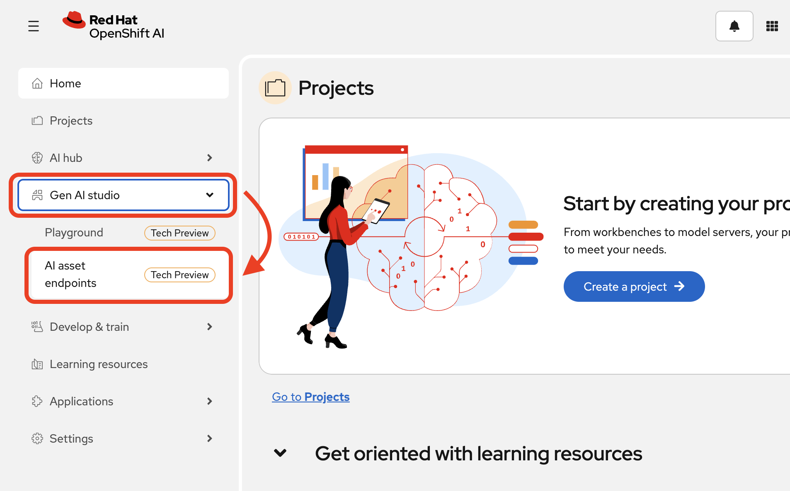

- Select the **Models as a Service** tab

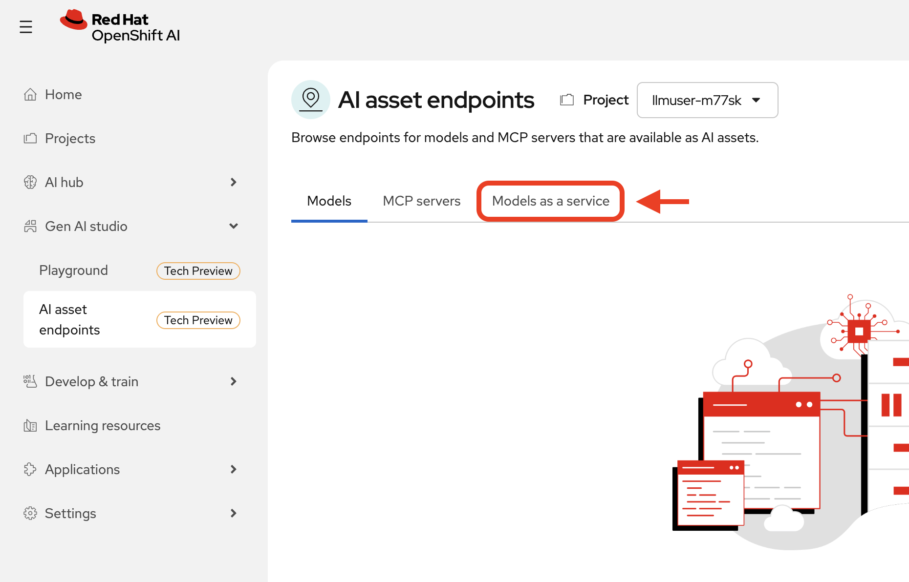

You'll see the `nemotron-3-nano-30b-a3b` model deployed and ready to use.

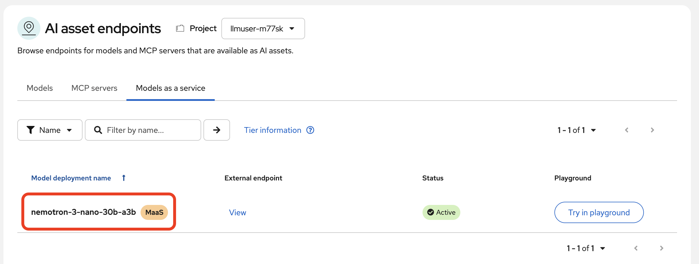

Let's grab the endpoint to use in our code assistant. Select `View` under the `External endpoint` column:

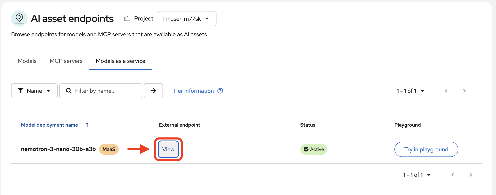

Copy the MaaS route and save it in a note file - you'll need this in the next module.

> **Note:** To copy the route, highlight the text and use Ctrl+C (or Cmd+C on Mac).

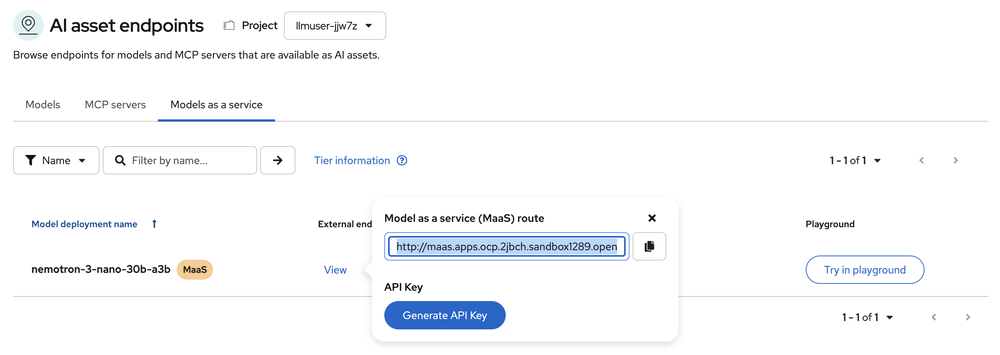

Now, click `Generate API token`.

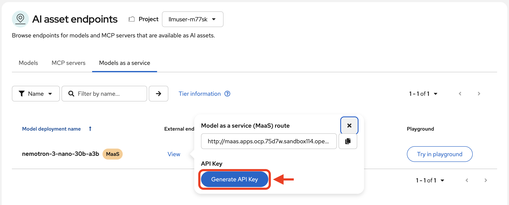

Copy this API token and save it with your route endpoint - you'll need both values in the next module.

> **Note:** Highlight the token text and copy with Ctrl+C (or Cmd+C on Mac).

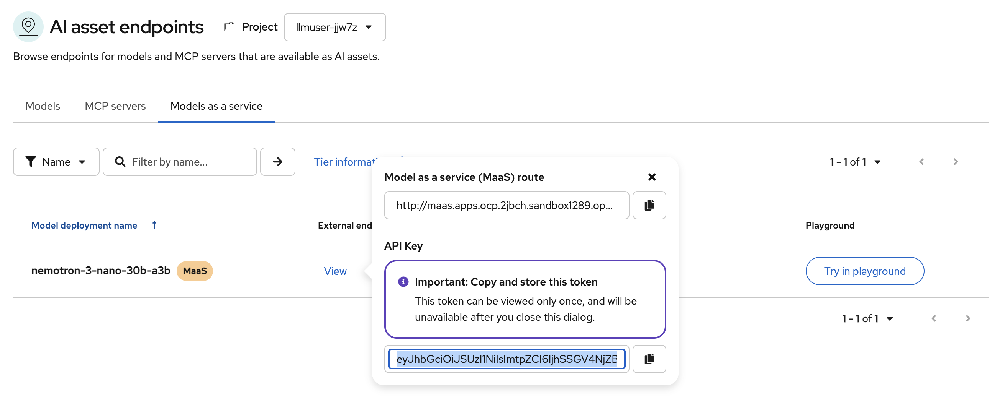

Now that we have our model connection details, we can proceed to our development environment to leverage the model.

### Understanding the value of Models as a Service

This MaaS pattern reflects best practice: platform teams centralize infrastructure management (deploying models, managing endpoints, handling credentials) while making consumption simple for users. You get secure access without struggling with infrastructure details.

---

## AI-Assisted Development

Now that you have your model endpoint and API key, you'll use OpenShift Dev Spaces as your development environment and connect it to your MaaS endpoint.

AI code assistants understand full project context, edit code through natural language instructions, and automate tedious tasks like generating tests or refactoring. Integrated directly into your IDE, they help you build better software faster.

### Setting up a cloud integrated developer environment (IDE) with OpenShift Dev Spaces

OpenShift Dev Spaces delivers instant access to pre-configured, containerized workspaces running on your OpenShift cluster. It ensures consistency across your team, eliminates "works on my machine" problems, and keeps your development environment in sync with your deployment target.

### Access OpenShift Dev Spaces

* Navigate to the OpenShift Dev Spaces application.

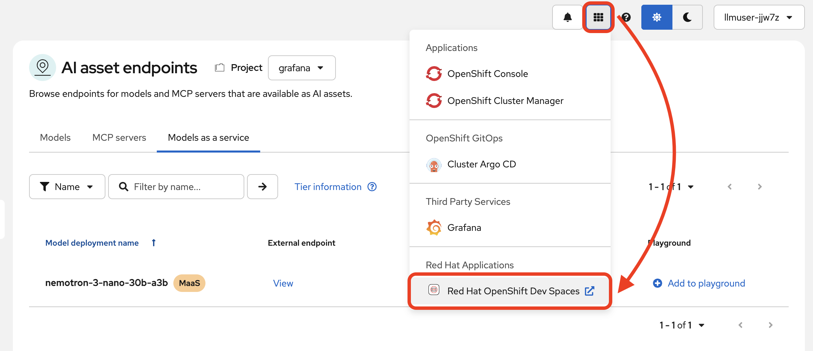

When prompted for your login credentials, repeat the same log in.

Once authenticated, you will see the OpenShift Dev Spaces central dashboard. We have prepared a workspace for you to access. This is a VS Code IDE workspace with the AI quickstart repository code already cloned in and necessary dependencies configured.

Click `Open`:

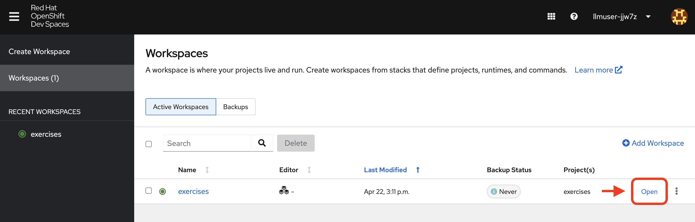

After a moment, you'll see the VS Code interface running in your browser. If prompted, click "Trust" when asked about the authors.

We have pre-configured the Dev Spaces workspace to install the Continue code assistant extension. You will be prompted to `trust the Continue publisher`. Click `Trust publisher & Install`:

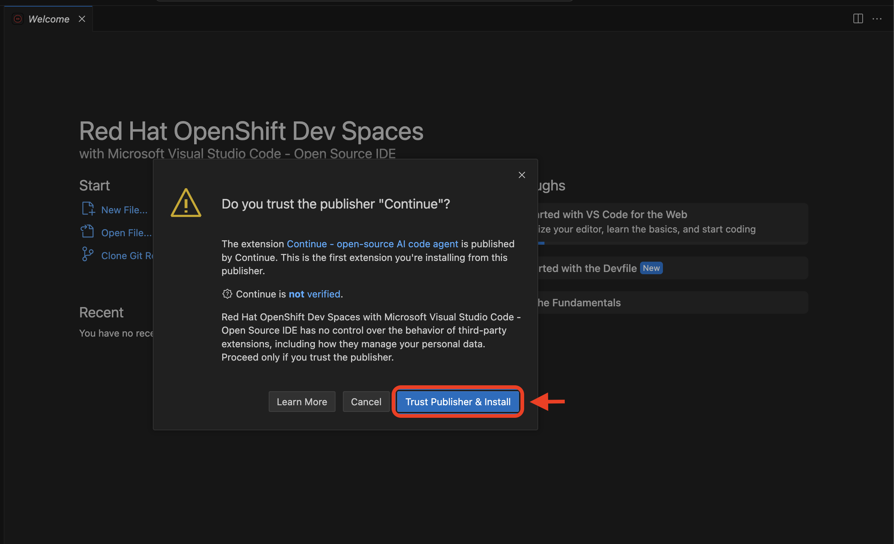

In our workspace you'll find a repository ready for your use. This is where you will build and refine with some AI assistance. The only thing we need to configure now is our model connection to the Continue extension.

> **Note:** The repository you are in is for the [Accelerate enterprise development with NVIDIA and MaaS](https://docs.redhat.com/en/learn/ai-quickstarts/rh-maas-code-assistant) AI quickstart.

### Meet Your AI Code Assistant

**Continue** is an open-source AI code assistant that integrates into VS Code. Continue provides an interactive chat interface where you can have natural conversations about your code.

Continue supports custom model endpoints, making it a nice example for connecting to your private enterprise models. Continue is an **open-source** solution that gives you complete control over your AI coding workflow.

> **Note:** Continue is an example of an AI-powered coding assistant for this AI quickstart. You can easily imagine how this could work with any other desired code assistant extensions that allow you to customize the model used.

### Connect to Your MaaS Model

Navigate to the **Continue sidebar icon** in the left-hand side navigation panel. If needed, expand the Continue app sidebar by dragging the border over.

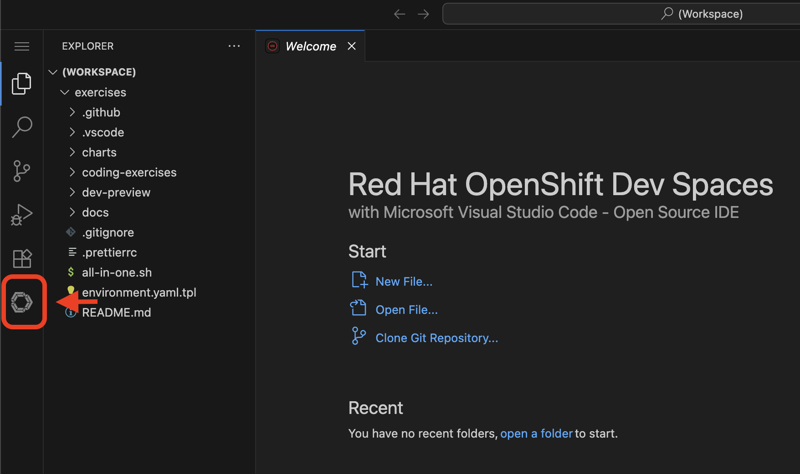

In order to connect our model to the Continue code extension we must provide the extension our model's endpoint URL and API key from our MaaS deployment from the previous module.

> **Note:** If you didn't document your model access information, go back to the OpenShift AI dashboard to the **AI asset endpoints** section to retrieve the credentials.

### Configure the Code Assistant Extension

We've provided a pre-configured template file for the Continue extension. You'll need to move it to the proper location where Continue expects to find it.

Open a terminal in VS Code (Terminal > New Terminal from the menu, or Ctrl+`)

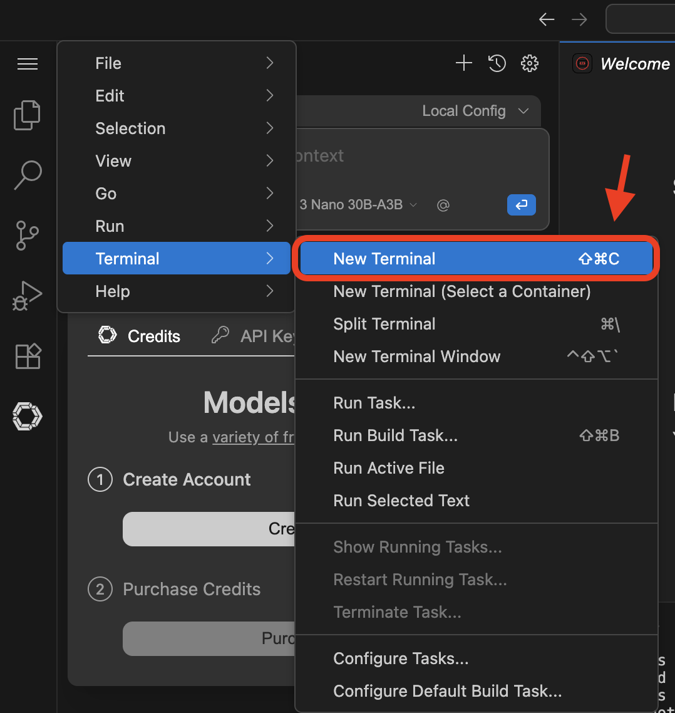

In the terminal, run the following command:

```bash
cp /projects/exercises/.vscode/config.yaml ~/.continue/config.yaml
```

This copies the template configuration file to `~/.continue/config.yaml`, replacing the blank template that's there.

Now open the configuration file to customize it with your MaaS endpoint details. Open the search bar (Cmd+P on Mac or Ctrl+P on Linux) and type:

```
~/.continue/config.yaml
```

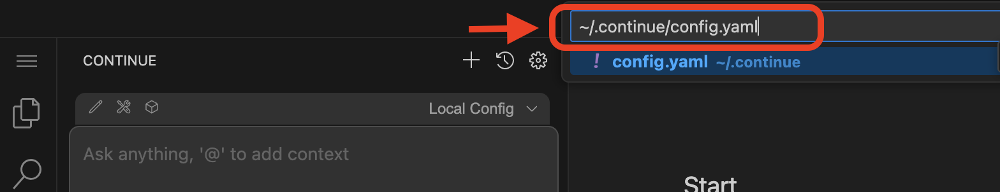

Hit `Enter` to open the file. You'll see the following configuration:

```yaml
name: Local Assistant
version: 1.0.0
schema: v1
models:
  - name: NVIDIA Nemotron 3 Nano 30B A3B FP8
    provider: openai
    model: "nemotron-3-nano-30b-a3b"
    apiBase: "YOUR_MAAS_ROUTE/v1"
    apiKey: "YOUR_API_KEY"
context:
  - provider: code
  - provider: docs
  - provider: diff
  - provider: terminal
  - provider: problems
  - provider: folder
  - provider: codebase
```

> **Important:** Replace the `apiBase` URL with your actual MaaS endpoint URL and `YOUR_API_KEY` with the API key from your MaaS application. Ensure you retain the `v1` at the end of the path.

For example:

* **apiBase**: `http://maas.apps.ocp.75d7w.sandbox114.opentlc.com/llm/nemotron-3-nano-30b-a3b/v1` (Note the `v1` at the end of the URL)
* **apiKey**: `your-actual-api-key-here`

> **Note:** You may reference the complete configuration documentation here: [Continue Documentation](https://docs.continue.dev/reference)

When the model is properly configured, you will be able to chat with the model in the sidebar.

> **Note:** This workshop and model configuration only support Chat mode for the Continue extension. Ensure it is set to `Chat` and not `Agent` or `Plan`.

Go ahead - test it out with the following prompt:

```
Explain the software company Red Hat in a short paragraph.
```

> **Note:** If you get an error when chatting with the model, double check your API key and route details. Ensure you have left the `/v1` at the end of the URL string.

### You're Ready to Code with AI

You've now:

* Set up a cloud IDE
* Installed Continue and configured it to connect to your private Nemotron model
* Set up an AI assistant that can refactor, edit and explain your code!

Next, you will use Continue to help you develop a little fun game.

---

## Game Time

Now that your AI assistant is wired up, build a simple game using Continue's help. You're exploring AI-assisted coding through something fun while building confidence with the tools.

### Choose and Build Your Game

Pick **one** of the following lightweight games (available in both Python and Bash):

1. **Rock Paper Scissors**: Play against the computer!
2. **Word Scramble**: Unscramble words for points
3. **Simple Quiz Game**: Answer trivia questions for a final score

From the file explorer, navigate to `game_starters` and select your game and language preference.

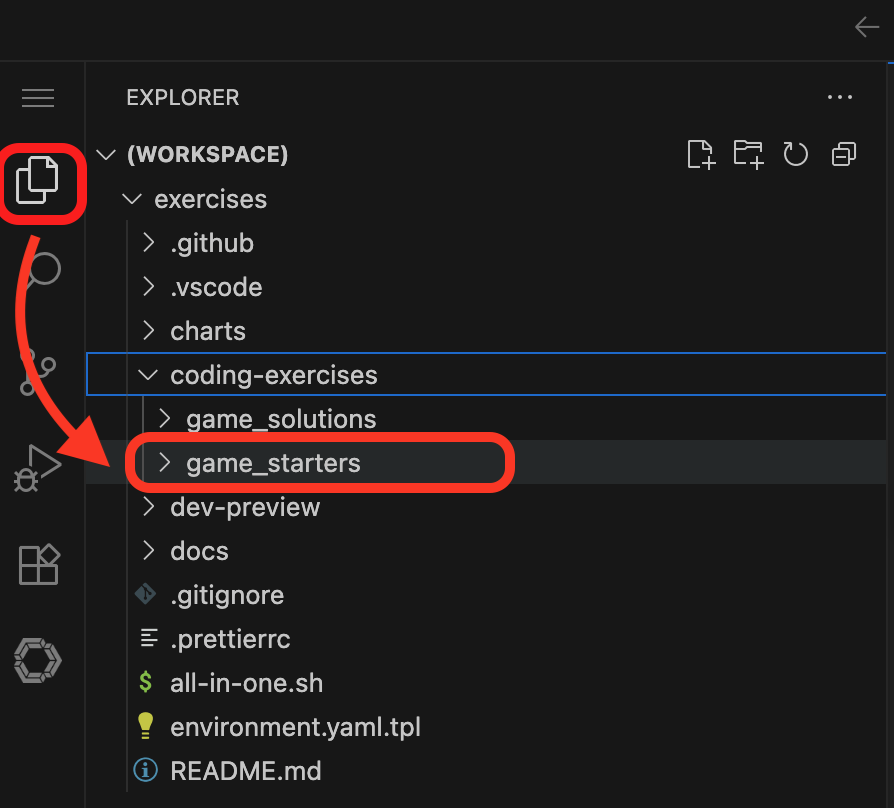

Each starter file contains three commented sections: an initial prompt to generate your game, AI assistance techniques, and enhancement ideas.

### Build Workflow

**Step 1: Generate code with AI**

Open your chosen game file and copy the prompt from the 🎯 Initial Prompt section. Paste it into the Continue chat interface (ensure it's set to `Chat` mode, not Agent or Plan).

**Step 2: Add code to your file**

Copy the AI-generated code and paste it **below all the commented instructions** in your file. Use the `Insert Code` button or paste manually.

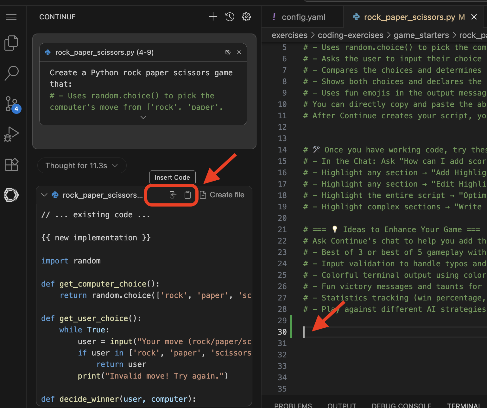

**Step 3: Test your game**

Save your file, open a terminal (`Terminal` → `New Terminal` or Ctrl+`), navigate to your game folder, and run:

```console
cd ./coding-exercises/game_starters/rock_paper_scissors/
python your_filename.py  # For Python
# OR
chmod +x your_filename.sh && ./your_filename.sh  # For Bash (first time)
```

Play your game! If you see errors, paste them into Continue's chat with "I got this error, can you help me fix it?"

**Step 4 (Optional): Enhance your game**

Look at the 💡 Enhancement Ideas in your starter file comments. Use Continue to add features, improve code quality, or experiment.

### Using AI to Enhance Code

Continue offers two ways to improve your game:

**1. Chat Interface** - Ask questions directly:
* "How can I add more questions to my quiz?"
* "Explain what this code does"

**2. Interactive Code Assistance** - Highlight code, right-click, and select `Continue`:

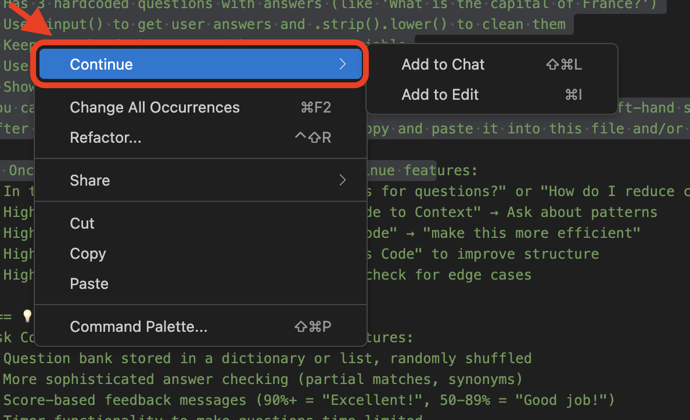

* **Add to Chat** - Ask questions about highlighted code
* **Add to Edit** - Describe changes for AI to make (e.g., "add error handling")

> **Tip:** Use chat to generate initial code, then "Add to Edit" on specific sections to refine them.

### Need Help?

Reference solutions are available in the `game_solutions/` directory. Run them using the same commands above to see how they work.

---

## Usage Analytics

Now that you've used the MaaS model a bit, let's see how the platform tracks usage.

### View the Grafana Dashboard

1. Select the **Grafana Dashboard** tab. Log in again with your credentials if prompted.

2. Go to the **grafana** dashboard

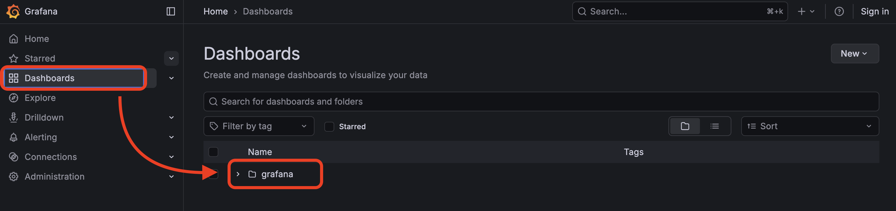

3. Select **MaaS Token Metrics Dashboard**

### What You're Seeing

This dashboard shows real usage metrics from the Prometheus observability stack:

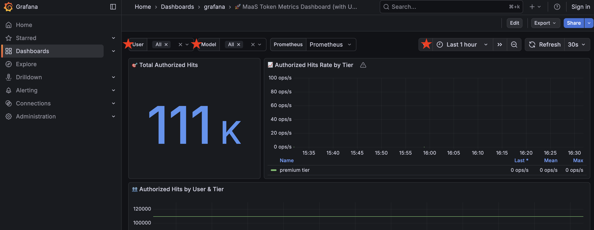

Key metrics:

* **Total Authorized Hits**: Total token count across all users
* **Top Users by Hits**: Who's using the model most
* **Hourly Usage**: Usage patterns over time
* **Cost by User**: Estimated costs based on tier pricing (Enterprise tier)

**Your activity is here** - the work you just did in OpenShift Dev Spaces generated tokens, and they're being tracked in this dashboard.

> **Note:** This is a **custom Grafana dashboard** integrating with Red Hat AI's Prometheus metrics stack. While this specific dashboard is a workshop example, it demonstrates how you can leverage the platform's built-in observability. Red Hat AI will include integrated analytics in upcoming releases.

### Why This Matters

For platform teams, this visibility enables:

* **Capacity planning**: Track growth trends to justify GPU scaling
* **Cost attribution**: Chargeback models based on actual consumption
* **ROI measurement**: Prove business value with usage data

**Solving the MaaS problem**: Instead of idle or overloaded GPUs without accountability, you now have measurable, optimized infrastructure with clear usage tracking - transforming AI from a cost center into a managed platform service.